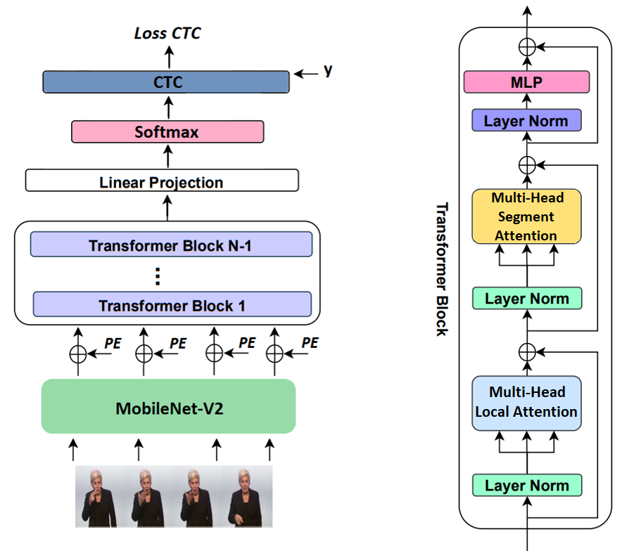

# Continuous Sign Language Recognition Using Intra-Inter Gloss Attention

This repository provides a pytorch-based implementation of **Continuous Sign Language Recognition Using Intra-Inter Gloss Attention**.

Sign languages are the primary communication medium of the hearing-impaired people. Mastering this language is rather difficult
for the hearing people, thus hindering direct communications between two groups. Sign Language Recognition provides a bridge to
overcome this gap. Our propose model consists of three modules : the visual module (MobileNet-V2), the sequential module(Transformer)
and the alignment module(CTC). This work represents the first attempt in the field of continuous sign language recognition
to incorporate an intra-inter gloss attention module. These two modules are embedded within the sequential module and used in
place of the vanilla self-attention module.

**Overview of our propose model is provided in below.**

---

1- First, download **PHOENIX-RWTH-WEATHER 2014** from [this link](https://www-i6.informatik.rwth-aachen.de/ftp/pub/rwth-phoenix/2016/phoenix-2014.v3.tar.gz). Then extract the comperessed file(.tar.gz).

2- Use following command for removing background of images:

 ## Train

 python -u train_seg_att.py --data /$DATAROOT/phoenix2014-release/phoenix-2014-multisigner \
    --train_segment_root /home/artaheri.sharif/train_segmentation --weight_decay 1e-5\
    --val_segment_root /home/artaheri.sharif/val_segmentation --local_window 6 \
    --data_type 'features' --lookup_table  /home/artaheri.sharif/SLR_lookup_pickle.txt \
    --num_workers 4 --batch_size 2 --dp_keep_prob 0.9 --save_dir /home/artaheri.sharif/san/trained_model \
    --data_stats /home/artaheri.sharif/san/source/data_stats.pt --pretrained True --scheduler 'multi-step' --milestones "10,30"\
    --hand_stats /home/artaheri.sharif/san/source/hand_stats.pt > 
 

