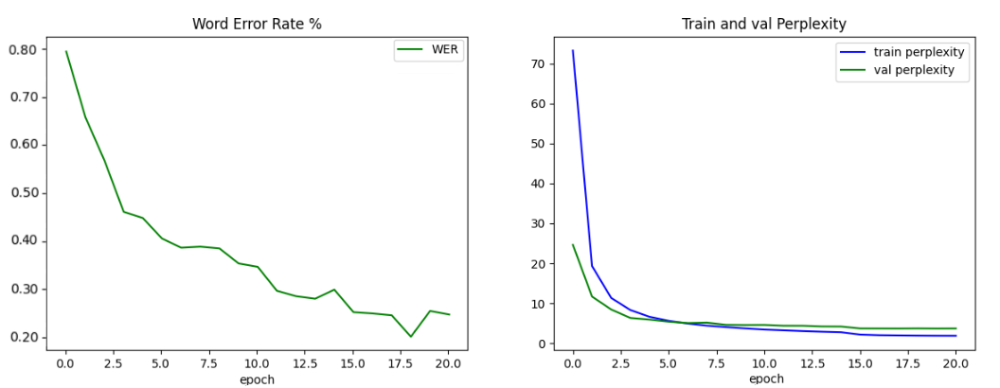

<h1 align="center">Continuous Sign Language Recognition Using Intra-Inter Gloss Attention</h1>

  <b>
    Hossein Ranjbar, Alireza Taheri
  </b>

  Department of Mechanical Engineering, Sharif University of Technology, Tehran, Iran  

  

 ---

This repository provides a pytorch-based implementation of **Continuous Sign Language Recognition Using Intra-Inter Gloss Attention**.

Sign languages are the primary communication medium of the hearing-impaired people. Mastering this language is rather difficult
for the hearing people, thus hindering direct communications between two groups. Sign Language Recognition provides a bridge to
overcome this gap. Our propose model consists of three modules : the visual module (MobileNet-V2), the sequential module(Transformer)
and the alignment module(CTC). This work represents the first attempt in the field of continuous sign language recognition
to incorporate an intra-inter gloss attention module. These two modules are embedded within the sequential module and used in
place of the vanilla self-attention module.

**Overview of our propose model is provided in below.**

---

1- First, download **PHOENIX-RWTH-WEATHER 2014** from [this link](https://www-i6.informatik.rwth-aachen.de/ftp/pub/rwth-phoenix/2016/phoenix-2014.v3.tar.gz). Then extract the comperessed file(.tar.gz).

2- Use following command for removing background of images for the train, test and validation sets:

<pre>
python ./segmentation/extract_segmentation.py --data_path $DATASET_PATH --des_path ./segmentation/train_segmentation 
</pre>

### An example of remove background from the image

  

 ## Train

Train our porpose model on **PHOENIX-RWTH-WEATHER 2014**.
 <pre>
 python -u ./CSLR-IIGA/IIGA/train.py --data ./$DATAROOT/phoenix2014-release/phoenix-2014-multisigner \
    --train_segment_root ./CSLR-IIGA/segmentation/train_segmentation --weight_decay 1e-5\
    --val_segment_root ./CSLR-IIGA/segmentation/val_segmentation --local_window 6 \
    --data_type 'features' --lookup_table  ./CSLR-IIGA/tools/data/SLR_lookup_pickle.txt \
    --num_workers 4 --batch_size 2 --dp_keep_prob 0.9 --save_dir ./CSLR-IIGA/trained_model \
    --data_stats ./CSLR-IIGA/tools/data/data_stats.pt --pretrained True --scheduler 'multi-step' --milestones "10,30"
  </pre>

  **data** : the train dataset root

  **train_segment_root**: path of train segmentation file(it contains numpuy arraies)

  **val_segment_root** : path of validation segmentation file

  **local_window** : the window size in intra gloss attention

  ### Plot of train and validation WER and loss during training

  

  ## Test

  Evaluate porpose model on the test set:

<pre>
python -u test.py --data ./CSLR-IIGA/phoenix2014-release/phoenix-2014-multisigner \
    --test_segment_root ./CSLR-IIGA/segmentation/test_segmentation \
    --val_segment_root ./CSLR-IIGA/segmentation/val_segmentation \
    --model_path ./CSLR-IIGA/trained_model/ \
    --lookup_table  ./CSLR-IIGA/tools/data/SLR_lookup_pickle.txt \
    --data_stats ./CSLR-IIGA/tools/data/data_stats.pt 
</pre>

**model_path** : path of pretrained model weights

2 samples of prediction of our propose model are provided in below:

## Prediction

To predict a video, use the following command.

<pre>
python -u prediction.py --data ./CSLR-IIGA/phoenix2014-release/phoenix-2014-multisigner/features/fullFrame-210x260px/test \
    --model_path ./CSLR-IIGA/trained_model/ \
    --csv_path ./CSLR-IIGA/phoenix2014-release/phoenix-2014-multisigner/annotations/manual/test.corpus.csv \
    --lookup_table  ./CSLR-IIGA/tools/data/SLR_lookup_pickle.txt \
    --idx 4 --data_stats ./CSLR-IIGA/tools/data/data_stats.pt 
</pre>

**data** : Test video address

**model_path** : path of pretrained model weights

**idx** : number or index of a video

 

